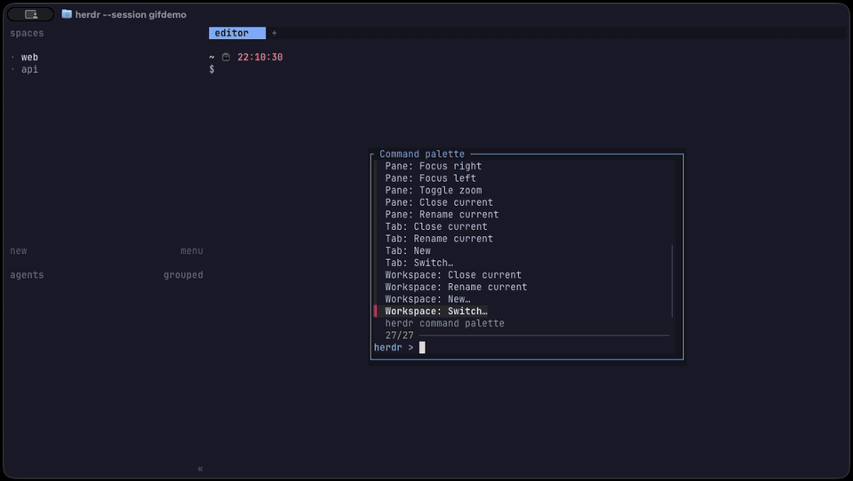

# herdr-command-palette (hota911.command-palette)

日本語版: [README.ja.md](README.ja.md)

An fzf command palette for herdr's built-in operations: Workspace, Tab, Pane, Agent, and
Config.



## Usage

Press `prefix+shift+p`. The palette opens as a popup over your current pane, listing every
command below. Fuzzy-search or arrow-select the one you want and hit enter.

- Some commands ask for more input before running:
  - **Free input** (e.g. renaming a tab, a workspace directory) — type a value and press
    enter. Leaving a required field empty and confirming cancels the command; Esc cancels at
    any time.
  - **Selection from a list** (e.g. which workspace, tab, or agent to switch to) — fuzzy-search
    or arrow-select an entry from the list, same as the main palette. Esc cancels.
  - **Confirmation** — destructive commands (closing a workspace, tab, or pane) ask Yes/No
    first, defaulting to No. Choosing No, pressing Esc, or pressing Enter without picking
    anything all cancel without running the command.
- Esc at the main picker closes the palette without doing anything.

## Available commands

- **Workspace:** Switch…, Next, Previous, New…, Rename current, Close current
- **Tab:** Switch…, Next, Previous, New, Rename current, Close current
- **Pane:** Rename current, Close current, Toggle zoom, Focus left/right/up/down, Split
  right/down, Swap left/right/up/down, Resize left/right/up/down
- **Agent:** Focus…
- **Config:** Reload

All commands act on the pane, tab, or workspace that opened the palette, except commands that
target something else by design (e.g. `Workspace: Switch…`, `Agent: Focus…`).

### Not covered

This palette targets what herdr's public CLI can do. See the design document's
[built-in keybinding coverage table](docs/design/command-catalog.md#mapping-to-built-in-keybindings)
for which built-in keybindings have no equivalent here, and why.

## Requirements

This plugin does not install any system tools for you. You need to have the following in
place beforehand:

- [fzf](https://github.com/junegunn/fzf)
- [jq](https://github.com/jqlang/jq)
- herdr 0.8.0 or later

## Installation

```bash
herdr plugin install hota911/herdr-command-palette
```

For local development, link a working copy instead.

```bash
herdr plugin link /path/to/herdr-command-palette
```

## Keybinding

Add the following to `~/.config/herdr/config.toml`. This plugin's example uses
`prefix+shift+p`, which leaves `prefix+p` free for jt.command-palette if you use it.

```toml
[[keys.command]]
key = "prefix+shift+p"
type = "plugin_action"
command = "hota911.command-palette.open"
description = "Command palette (built-ins)"
```

## How it works

- **action `open`** runs on the herdr server side (no TTY) and opens the palette as a popup
  pane, which does have a TTY. The popup is session-modal and sized independently of your
  tiled layout, and doesn't show up in your pane list.
- If your herdr version is below the plugin's minimum, herdr won't load the plugin at all. If
  the herdr you're running has drifted from the protocol version this catalog was built
  against, or if that protocol can't be read at all, the palette header shows a warning — it
  still works, the warning just flags possible staleness. If a command you pick fails, the
  palette shows the error (the group, subcommand, and herdr's own output) and waits for a
  keypress instead of silently closing.

## Related plugin

JanTvrdík's [jt.command-palette](https://github.com/JanTvrdik/herdr-command-palette) is a
palette for plugin actions, not herdr's own built-in operations (tab close, pane split, and so
on). The two plugins don't overlap and can be used side by side: `prefix+p` opens
jt.command-palette, `prefix+shift+p` opens this one.

This plugin's popup plumbing and error-visibility pattern are adapted from
jt.command-palette (MIT); the source is credited in [LICENSE](LICENSE) and in source comments.
